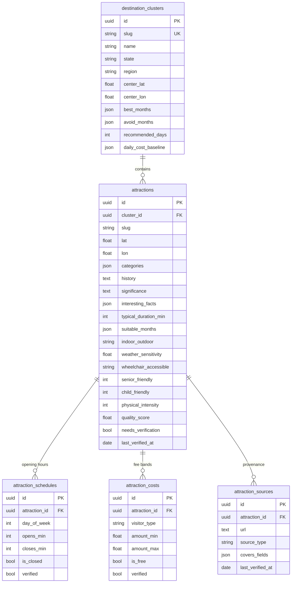
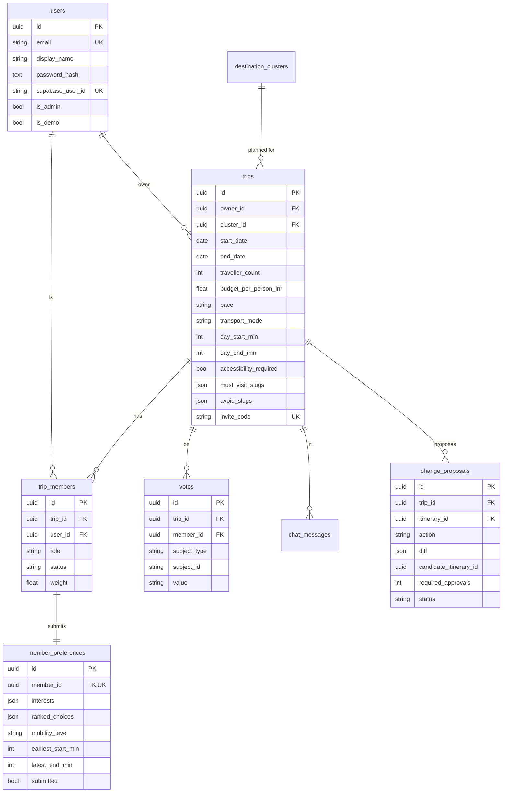
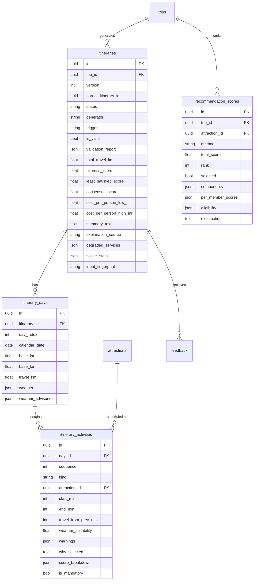
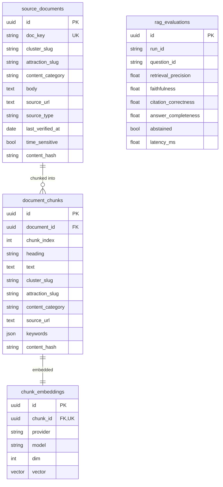
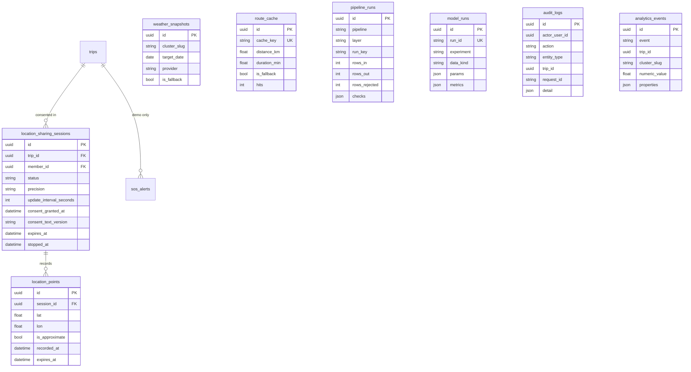

# Entity-relationship model

31 tables in five groups. Rendered as Mermaid — GitHub displays this natively.

## Catalogue (the fact layer)

`UNIQUE (cluster_id, slug)` lets two clusters both have a `fort`.
`verified` on schedules and costs is **always false** in the seed set — a data-quality test
enforces it.

## Trips and collaboration

`UNIQUE (member_id, subject_type, subject_id)` on votes makes one-member-one-vote a schema
guarantee rather than application logic.

## Itineraries

`UNIQUE (trip_id, version)` gives an append-only version history — a modification supersedes
rather than mutates, which is what makes the trip-analytics timeline possible.

## Knowledge base

Cluster, attraction and category are **denormalised onto chunks** so metadata filtering needs no
join on the hot retrieval path.

## Location and operations

Two schema-level privacy guarantees: every session carries `expires_at`, and every point carries
its own `expires_at`. There is no table capable of holding permanent location history.

`model_runs.data_kind` records `synthetic | real | mixed` so an ML result can never be mistaken
for one trained on genuine labels.

## Constraints worth noting

| Constraint | Prevents |
|---|---|
| `attraction_lat_range`, `attraction_lon_range` | Impossible coordinates |
| `attraction_duration_positive` | Zero-length visits |
| `trip_date_order` | End before start |
| `trip_day_window` | Day ending before it starts |
| `cost_range_valid` | `max < min` |
| `activity_time_order` | Non-positive activity duration |
| `loc_interval_min` (≥ 15 s) | Location polling abuse |
| `uq_vote_member_subject` | Double voting |
| `uq_attraction_cluster_slug` | Duplicate attractions in a cluster |
| `uq_itinerary_trip_version` | Version collisions |
